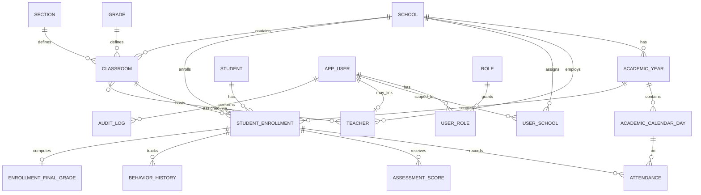

# FWIS Entity Relationship Diagram

```mermaid
erDiagram
    SCHOOL ||--o{ ACADEMIC_YEAR : has
    SCHOOL ||--o{ TEACHER : employs
    SCHOOL ||--o{ USER_SCHOOL : assigns
    SCHOOL ||--o{ STUDENT_ENROLLMENT : enrolls
    SCHOOL ||--o{ CLASSROOM : contains

    ACADEMIC_YEAR ||--o{ ACADEMIC_CALENDAR_DAY : contains
    ACADEMIC_YEAR ||--o{ STUDENT_ENROLLMENT : scopes

    GRADE ||--o{ CLASSROOM : defines
    SECTION ||--o{ CLASSROOM : defines
    CLASSROOM ||--o{ STUDENT_ENROLLMENT : hosts
    CLASSROOM }o--o{ TEACHER : assigned_via

    STUDENT ||--o{ STUDENT_ENROLLMENT : has
    STUDENT_ENROLLMENT ||--o{ ATTENDANCE : records
    STUDENT_ENROLLMENT ||--o{ ASSESSMENT_SCORE : receives
    STUDENT_ENROLLMENT ||--o{ BEHAVIOR_HISTORY : tracks
    STUDENT_ENROLLMENT ||--o| ENROLLMENT_FINAL_GRADE : computes

    ACADEMIC_CALENDAR_DAY ||--o{ ATTENDANCE : on

    APP_USER ||--o{ USER_ROLE : has
    ROLE ||--o{ USER_ROLE : grants
    APP_USER ||--o{ USER_SCHOOL : scoped_to
    APP_USER ||--o| TEACHER : may_link
    APP_USER ||--o{ AUDIT_LOG : performs
```

See `prisma/schema.prisma` for the full PostgreSQL schema.
