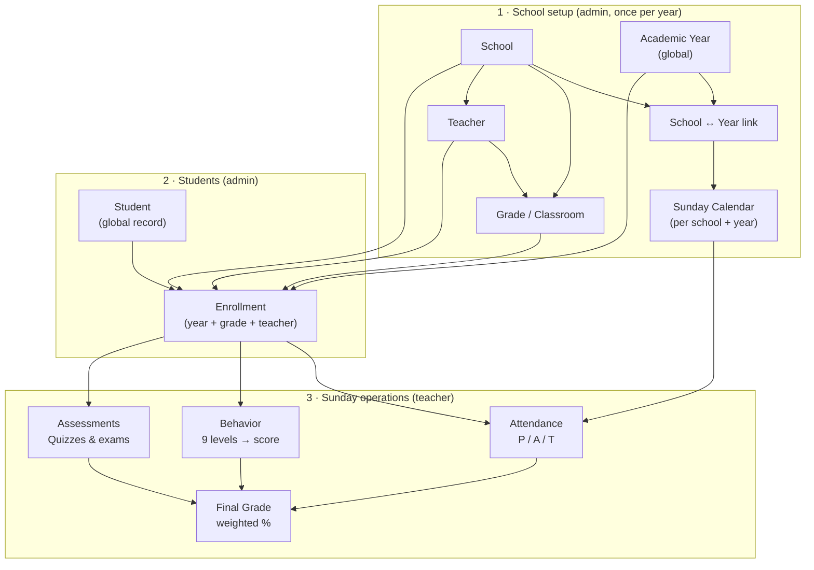
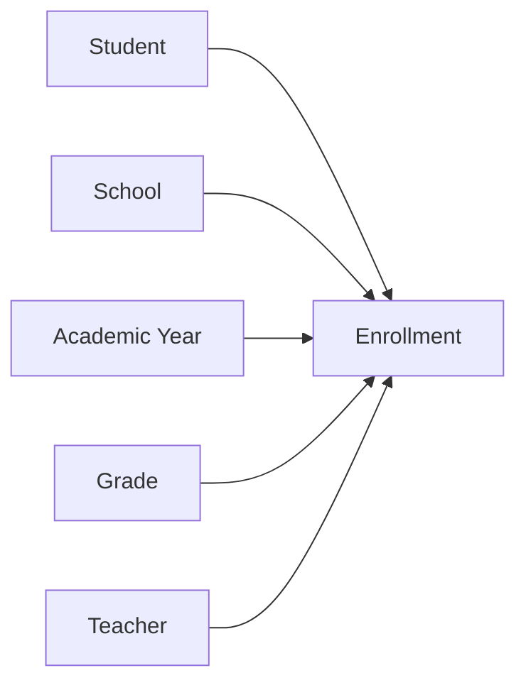
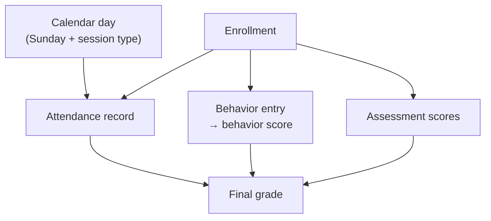

# FWIS Leadership Demo

> **Present mode:** Open [`LEADERSHIP_DEMO.html`](./LEADERSHIP_DEMO.html) in your browser. Slide 9 is a **demo coverage checklist** (checkboxes you can tick during prep). The deck uses Mermaid for diagrams (requires internet on first load). Auth is **app-managed**; database is **PostgreSQL on SmarterASP.NET**.

This deck explains **what FWIS does** and **how school data is organized** — from campus setup through Sunday attendance, behavior, and assessments.

---

## Slide 1 — Title

**Faizan Weekend Islamic School Management System (FWIS)**

One platform for Sunday schools: setup a campus once per year, enroll students, then track attendance, behavior, and grades every Sunday.

---

## Slide 2 — Features

| Area | What FWIS does |
|---|---|
| **School setup** | Manage schools, academic years, Sunday calendar, grades (1–6 Boys/Girls), and teachers |
| **Students** | Global student records; one person, many enrollments across years |
| **Enrollments** | Link each student to a school, year, grade, and teacher |
| **Attendance** | Mark Present / Absent / Tardy per student per Sunday; consolidate matrix for admins |
| **Behavior** | Nine behavior levels adjust each student’s behavior score (starts at 100) |
| **Assessments** | Quiz 1–5, midterm project, final exam scores in a classroom grid |
| **Final grades** | Weighted formula: 10% attendance + 10% behavior + 25% quizzes + 55% exams → letter grade & rank |
| **Access control** | Super Admin, School Admin, Teacher, Read Only — scoped by school and grade |
| **Data import** | Excel workbook per school year; auto-creates teacher and Houston admin logins |
| **Security** | HTTPS, encrypted student PII, signed session cookies, RBAC, audit log |

---

## Slide 3 — School data hierarchy (overview)

Everything rolls up under a **School**. A global **Academic Year** (e.g. 2025–2026) is linked to each campus. Each school gets its **own calendar** for that year — one Sunday row per day with a session type. **Students** enroll into a **Grade** for that school/year; teachers record **Attendance**, **Behavior**, and **Assessments** against that enrollment.



**Read top to bottom:** configure the school → enroll students → teachers work on Sundays.

---

## Slide 4 — Setup layer (School → Year → Calendar)

| Entity | Role | Example |
|---|---|---|
| **School** | Top-level campus | Houston, Chicago, Dallas |
| **Academic Year** | Global Sunday season; linked to each school via checkboxes | 2025–2026 |
| **Calendar** | Belongs to **each school** for a given academic year — one row per Sunday | Houston 2025–26 Sundays ≠ Chicago 2025–26 Sundays |
| **Grade / Classroom** | 12 per school (Grades 1–6 × Boys/Girls) | Grade 1 Boys |
| **Teacher** | Assigned to one grade per year | Teaches Grade 1 Boys |

Each linked school/year has its own calendar. Those days drive which Sundays count toward attendance % and which session type applies (quiz day, holiday, etc.).

---

## Slide 5 — Student & enrollment

| Entity | Role |
|---|---|
| **Student** | Permanent record — name, gender, parent contact. Never duplicated. |
| **Enrollment** | Joins **Student + School + Academic Year + Grade + Teacher** for one season |

One student can have many enrollments (new year, new school, promoted grade). All Sunday data hangs off the **enrollment**, not the student alone.



---

## Slide 6 — Attendance, behavior & assessments

All three attach to the **same enrollment** for the selected academic year.



| Module | Captured | Feeds final grade? |
|---|---|---|
| **Attendance** | Present / Absent / Tardy per Sunday | Yes — 10% |
| **Behavior** | Outstanding through Misconduct | Yes — 10% (from enrollment behavior score) |
| **Assessments** | Quiz 1–5 (5% each), midterm (10%), final (45%) | Yes — 80% of academic weight |

**Consolidate Attendance** (admin): students × Sundays matrix across grades.

---

## Slide 7 — Users, roles & permissions

Each login is an **App User** with one or more roles and access to one or more schools. Permissions are enforced in the sidebar and on every server action.

### Roles at a glance

| Role | Scope | Setup | Students / Enroll | Sunday entry |
|---|---|---|---|---|
| **Super Admin** | All schools | Create/delete schools, all modules | All schools | Oversight, consolidate attendance |
| **School Admin** | Assigned school(s); optional Boys/Girls or single-grade scope | Calendar, grades, teachers, users (not create schools) | Their school / section / grade | Attendance matrix, assessments |
| **Teacher** | One assigned classroom | — | — | Attendance, behavior, assessments for their grade |
| **Read Only** | Assigned school(s) | View only | View only | View only |

### Example Houston logins (roles slide)

Created when adding the school with **Create default app users** (school code `HOU`). Passwords differ by role.

| Role | User ID | Password | Scope |
|---|---|---|---|
| **Principal** | `hou.principal` | `FwisPrincipal786!` | Entire Houston school |
| **School Admin** (Boys) | `hou.m.admin` | `FwisAdmin786!` | All Boys sections |
| **School Admin** (Girls) | `hou.f.admin` | `FwisAdmin786!` | All Girls sections |
| **Teacher** (Boys) | `hou.b.g1` | `FwisTeacher786!` | Grade 1 Boys classroom |
| **Teacher** (Girls) | `hou.g.g1` | `FwisTeacher786!` | Grade 1 Girls classroom |
| **Substitute** (Boys) | `hou.m.sub` | `FwisSub786!` | All Boys grades |
| **Substitute** (Girls) | `hou.f.sub` | `FwisSub786!` | All Girls grades |

Pattern: `{schoolCode}.principal`, `{schoolCode}.[m/f].admin`, `{schoolCode}.[b/g].g[1-6]`, `{schoolCode}.[m/f].sub`.

School Admins with gender (`hou.m.admin` / `hou.f.admin`) are section-scoped. Import **Staff** rows link to these existing user IDs — they do not create logins.

### Permission highlights

| Area | Super Admin | School Admin | Teacher | Read Only |
|---|---|---|---|---|
| Schools (create / delete) | Yes | No | — | View |
| Academic years & calendar | Yes | Yes (their schools) | — | View |
| Students & enrollments | Yes | Yes | — | View |
| Attendance & assessments | Yes | Yes | Own classroom | View |
| Users (`/users`) | Yes | Yes (their schools) | — | — |
| Backup & import template | Yes | Yes | — | — |
| Grading scale (edit system-wide) | Yes | View | — | View |

### Sidebar groups

| Group | Items |
|---|---|
| **Dashboard** | Role-specific home (Super Admin / School / Teacher) |
| **Classroom** | Attendance, Consolidate Attendance, Assessments, Lesson Plans, Transcript, Rankings |
| **Setup** | Schools, Academic Years, Calendar, Grades, Teachers, Grading Scale, Data Backup |
| **Students** | Students, Enrollments |
| **Admin** | Users (Super Admin & School Admin only) |

---

## Slide 8 — Security (plain language)

**Think of student data like school records in a locked office.**

| Protection | Simple explanation | What FWIS does |
|---|---|---|
| **HTTPS** | A sealed envelope on the road — nobody can read what you send while it travels | The site uses HTTPS so login, grades, and attendance are protected in the browser |
| **Encryption in transit** | Data is scrambled while moving between your computer and our servers | All web traffic uses TLS (the lock icon in the browser) |
| **Encryption at rest** | Sensitive papers stay in a locked filing cabinet, not on an open desk | Student private details (date of birth, parent phone, address) are encrypted in the database |
| **App security** | Only staff with the right key can open the right room | Sign-in required; signed session cookie; each role sees only their school/grade scope; actions are logged |
| **Input checks** | We verify forms before filing — reject bad or suspicious entries | Server-side validation on every form; limits on login attempts to block guessing |

**One-line summary for leadership:** Data is protected **on the way** (HTTPS), **at rest** (encrypted student PII), and **inside the app** (roles, login, validation).

---

## Slide 9 — Demo coverage checklist

Use this during prep or the live walkthrough. Check items off in [`LEADERSHIP_DEMO.html`](./LEADERSHIP_DEMO.html) (slide 9). Switch **School** and **Academic Year** in the app sidebar before most list pages.

### Global · Dashboards

| ☐ | Area | Route | What to show |
|---|---|---|---|
| ☐ | School switcher | sidebar | Super Admin: Houston vs Chicago; teachers, grades, enrollments filter to selected school |
| ☐ | Academic year switcher | sidebar | Calendar, enrollments, rankings, lesson plans follow selected year |
| ☐ | Super Admin dashboard | `/dashboard/super-admin` | Nationwide stats, top schools, Sunday attendance widget |
| ☐ | School Admin dashboard | `/dashboard/school-admin` | Students by grade, behavior at-risk |
| ☐ | Teacher dashboard | `/dashboard/teacher` | My grade stats and highlights |

### Setup

| ☐ | Area | Route | What to show |
|---|---|---|---|
| ☐ | Schools | `/schools` | FWIS codes (FWIS-HOU); detail & edit |
| ☐ | Academic years | `/academic-years` | Global year; school checkboxes on edit; Drive year folder by name under FWIS Docs env parent |
| ☐ | Calendar | `/calendar` | Sundays; session types; bulk generate |
| ☐ | Grades | `/grades` | Grade 1–6 Boys/Girls per selected school |
| ☐ | Teachers | `/teachers` | Per-school list; assign one grade per teacher |
| ☐ | Grading scale | `/grading-scale` | Letter-grade thresholds |
| ☐ | Data backup | `/backup` | Export school year workbook; download import template |
| ☐ | Import (CLI) | `npm run import:school` | Load Houston/Chicago workbook; creates logins |

### Students

| ☐ | Area | Route | What to show |
|---|---|---|---|
| ☐ | Students | `/students` | Global records; search; export |
| ☐ | Student profile | `/students/[id]/profile` | Year-by-year history |
| ☐ | Enrollments | `/enrollments` | Link student + year + grade; grade & status filters |

### Classroom · Sunday operations

| ☐ | Area | Route | What to show |
|---|---|---|---|
| ☐ | Attendance | `/attendance` or `/teacher/attendance` | P / A / T + behavior per Sunday |
| ☐ | Consolidate attendance | `/attendance/consolidate` | Students × Sundays matrix |
| ☐ | Course Materials → Lesson plans | `/lesson-plans` | Drive PDFs: FWIS Docs/{year}/Lesson Plans/{grade} |
| ☐ | Course Materials → Assessments | `/assessments` | Drive PDFs: FWIS Docs/{year}/Assessments/{exam}/{grade} |
| ☐ | Transcript | `/transcript` | Printable class transcript |
| ☐ | Rankings | `/rankings` | Class rank; Export Certificate |

### Admin · Security

| ☐ | Topic | What to mention |
|---|---|---|
| ☐ | Users | `/users` — App Users, roles (Super/School/Teacher/Read Only), school access, section scope |
| ☐ | HTTPS | Lock icon; TLS in transit |
| ☐ | Encryption at rest | Student PII encrypted in database |
| ☐ | Role-based access | Teachers → their grade only |
| ☐ | Audit log | Recent activity on Super Admin dashboard |

**Suggested order:** Setup (year → calendar → grades → teachers) → People (student → enrollment) → Sunday (attendance → assessments → rankings/transcript).

---

## Slide 10 — Live demo

Run `npm run setup` once (lookups + super admin). Create the school in the app with **Create default app users**, then import Staff/Students:

```bash
npm run import:school -- --file path/to/houston-2025-2026.xlsx
```

| Role | User ID | Password | Notes |
|---|---|---|---|
| Super Admin | `majlis` | `SEED_SUPER_ADMIN_PASSWORD` (e.g. `FwisMajlis786!`) | Created by seed |
| Principal | `hou.principal` | `FwisPrincipal786!` | School create defaults |
| School Admin (Boys) | `hou.m.admin` | `FwisAdmin786!` | All Boys grades |
| School Admin (Girls) | `hou.f.admin` | `FwisAdmin786!` | All Girls grades |
| Teacher (Boys) | `hou.b.g1` | `FwisTeacher786!` | Grade 1 Boys |
| Teacher (Girls) | `hou.g.g1` | `FwisTeacher786!` | Grade 1 Girls |
| Substitute (Boys) | `hou.m.sub` | `FwisSub786!` | Boys section |
| Substitute (Girls) | `hou.f.sub` | `FwisSub786!` | Girls section |

**Suggested 10-minute flow**

1. Super Admin — switch school/year; show nationwide dashboard
2. Principal (`hou.principal`) — academic year link + calendar (setup)
3. School Admin (`hou.f.admin`) — Girls section scope (people / matrix)
4. Teacher (`hou.b.g1`) — attendance + behavior on a Sunday
5. Substitute (`hou.m.sub`) — Boys section attendance across grades

---

## Related docs

| Document | Contents |
|---|---|
| [`ER_DIAGRAM.md`](./ER_DIAGRAM.md) | Full database entity relationships |
| [`DATA_IMPORT.md`](./DATA_IMPORT.md) | Excel import workflow & Houston admin logins |
| [`SMARTERASP_SETUP.md`](./SMARTERASP_SETUP.md) | Hosting & PostgreSQL |
| [`pii-security.md`](./pii-security.md) | Student PII encryption |
| [`README.md`](../README.md) | Local setup, roles, commands |
