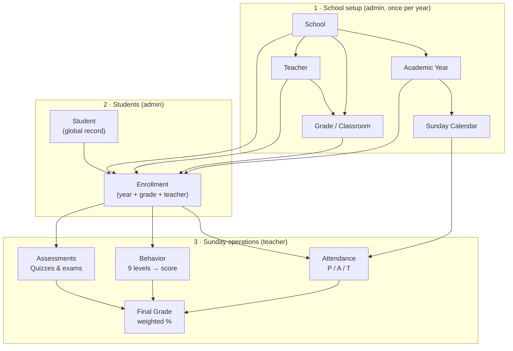
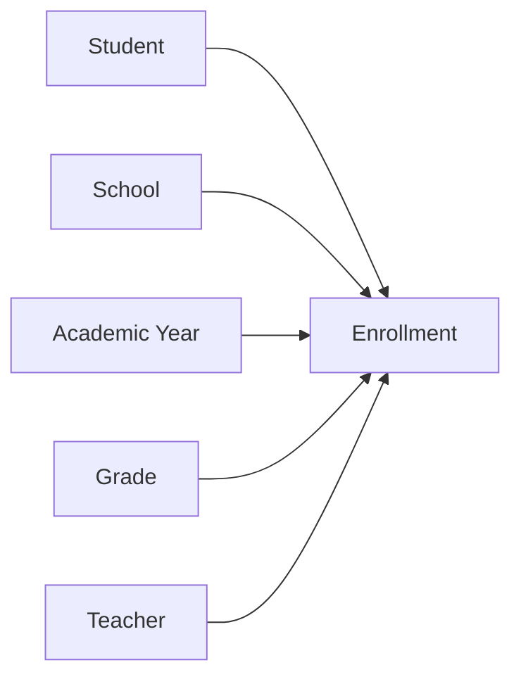
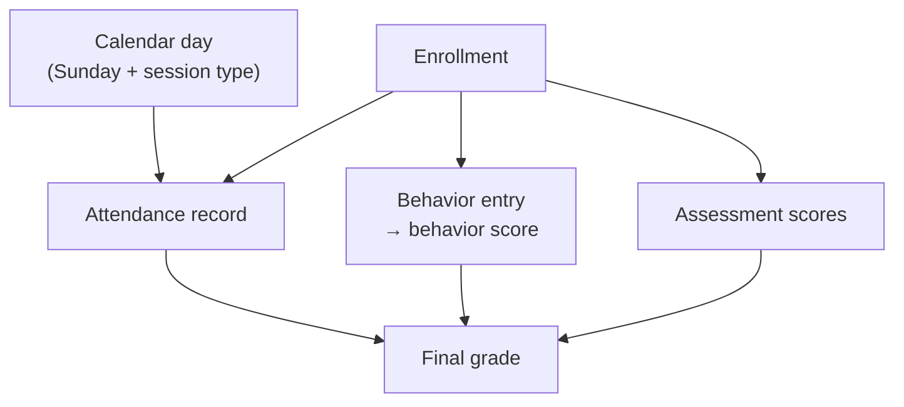

# FWIS Leadership Demo

> **Present mode:** Open [`LEADERSHIP_DEMO.html`](./LEADERSHIP_DEMO.html) in your browser. The deck uses Mermaid for the school hierarchy diagram (requires internet on first load for the Mermaid script).

This deck explains **what FWIS does** and **how school data is organized** — from campus setup through Sunday attendance, behavior, and assessments.

---

## Slide 1 — Title

**Faizan Weekend Islamic School Management System (FWIS)**

One platform for Sunday schools: setup a campus once per year, enroll students, then track attendance, behavior, and grades every Sunday.

---

## Slide 2 — Features

| Area | What FWIS does |
|---|---|
| **School setup** | Manage schools, academic years, Sunday calendar, grades (1–6 Boys/Girls), and teachers |
| **Students** | Global student records; one person, many enrollments across years |
| **Enrollments** | Link each student to a school, year, grade, and teacher |
| **Attendance** | Mark Present / Absent / Tardy per student per Sunday; consolidate matrix for admins |
| **Behavior** | Nine behavior levels adjust each student’s behavior score (starts at 100) |
| **Assessments** | Quiz 1–5, midterm project, final exam scores in a classroom grid |
| **Final grades** | Weighted formula: 10% attendance + 10% behavior + 25% quizzes + 55% exams → letter grade & rank |
| **Access control** | Super Admin, School Admin, Teacher — each role sees only what they need |

---

## Slide 3 — School data hierarchy (overview)

Everything rolls up under a **School**. Each **Academic Year** defines one Sunday season. The **Calendar** lists every Sunday and its session type. **Students** enroll into a **Grade** for that year; teachers record **Attendance**, **Behavior**, and **Assessments** against that enrollment.

**Read top to bottom:** configure the school → enroll students → teachers work on Sundays.

---

## Slide 4 — Setup layer (School → Year → Calendar)

| Entity | Role | Example |
|---|---|---|
| **School** | Top-level campus | Houston, Chicago, Dallas |
| **Academic Year** | One Sunday season under a school | 2025–2026 |
| **Calendar** | Every Sunday in that year with a session type | Instructional, Quiz 1–5, Holiday, Final exam |
| **Grade / Classroom** | 12 per school (Grades 1–6 × Boys/Girls) | Grade 1 Boys |
| **Teacher** | Assigned to one grade per year | Teaches Grade 1 Boys |

Calendar days drive which Sundays count toward attendance % and which session type applies (quiz day, holiday, etc.).

---

## Slide 5 — Student & enrollment

| Entity | Role |
|---|---|
| **Student** | Permanent record — name, gender, parent contact. Never duplicated. |
| **Enrollment** | Joins **Student + School + Academic Year + Grade + Teacher** for one season |

One student can have many enrollments (new year, new school, promoted grade). All Sunday data hangs off the **enrollment**, not the student alone.

---

## Slide 6 — Attendance, behavior & assessments

All three attach to the **same enrollment** for the selected academic year.

| Module | Captured | Feeds final grade? |
|---|---|---|
| **Attendance** | Present / Absent / Tardy per Sunday | Yes — 10% |
| **Behavior** | Outstanding through Misconduct | Yes — 10% (from enrollment behavior score) |
| **Assessments** | Quiz 1–5 (5% each), midterm (15%), final (40%) | Yes — 80% of academic weight |

**Consolidate Attendance** (admin): students × Sundays matrix across grades.

---

## Slide 7 — Roles (who uses what)

| Role | Setup | Students / Enroll | Sunday entry |
|---|---|---|---|
| **Super Admin** | All schools | All schools | Oversight |
| **School Admin** | Their school | Their school | Attendance matrix, all grades |
| **Teacher** | — | — | Their grade only: attendance, behavior, assessments |

---

## Slide 8 — Live demo

Run `npm run setup` once, then:

| Role | Email | Password |
|---|---|---|
| Super Admin | `superadmin@fwis.org` | `FwisAdmin786!` |
| School Admin | `admin.houston@fwis.org` | `FwisAdmin786!` |
| Teacher | `grade1.boys.houston@fwis.org` | `FwisTeacher786!` |

**Suggested 10-minute flow**

1. School Admin — academic year + calendar (setup hierarchy)
2. School Admin — add student → create enrollment (people hierarchy)
3. Teacher — mark attendance + behavior on a Sunday (operations)
4. Teacher — enter assessment scores → show final grade preview

---

## Related docs

| Document | Contents |
|---|---|
| [`ER_DIAGRAM.md`](./ER_DIAGRAM.md) | Full database entity relationships |
| [`DATA_IMPORT.md`](./DATA_IMPORT.md) | Legacy spreadsheet import |
| [`README.md`](../README.md) | Local setup |
